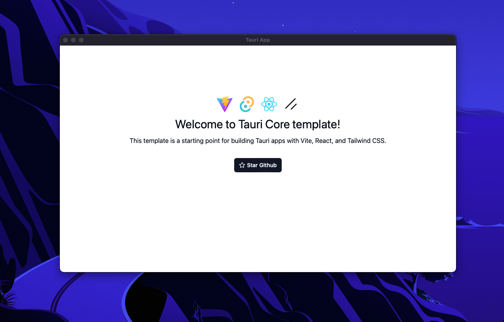

# Tauri: An Ultimate Project Template

This template should help get you started developing with [Tauri](https://tauri.app), [React](https://reactjs.org), [Typescript](https://typescriptlang.org) and [Tailwind CSS](https://tailwindcss.com) (w/ [shadcn/ui](https://ui.shadcn.com/)) in [Vite](https://vitejs.dev).

The architecture is based on practices suggested by [@alan2207](https://github.com/alan2207) in his [bulletproof-react](https://github.com/alan2207/bulletproof-react/blob/master/docs/project-structure.md).

In addition, this template configures [ESLint](https://eslint.org/), [Prettier](https://prettier.io/), [Husky](https://typicode.github.io/husky/) and [Lint-staged](https://github.com/lint-staged/lint-staged) for pre-commits.



## Getting Started

### Basics

Ensure that you have the [Tauri prerequisites](https://tauri.app/v1/guides/getting-started/prerequisites) installed.

#### Install dependencies

```bash
pnpm install
```

#### Start the development server

```bash
pnpm run tauri dev
```

## What's included

### Core

A basic Tauri setup with Vite, React, Typescript.

#### Tailwind CSS

A basic Tailwind CSS setup. Includes a `components.json` for Shadcn UI components.

### Dev Tools

#### Eslint 9

A new Eslint 9 setup with flat config. This will help you to keep your code clean and consistent.

#### Prettier

A basic Prettier setup to keep your code formatted.

#### Husky + Lint-staged

Pre-commit hooks to run Eslint and Prettier on staged files.

## Better Design

Shadcn UI is awesome, but have a look at these UI components to make your app stand out:

- [Magic UI](https://magicui.design)
- [Aceternity UI](https://ui.aceternity.com/)
- [Easy UI](https://www.easyui.pro/)
